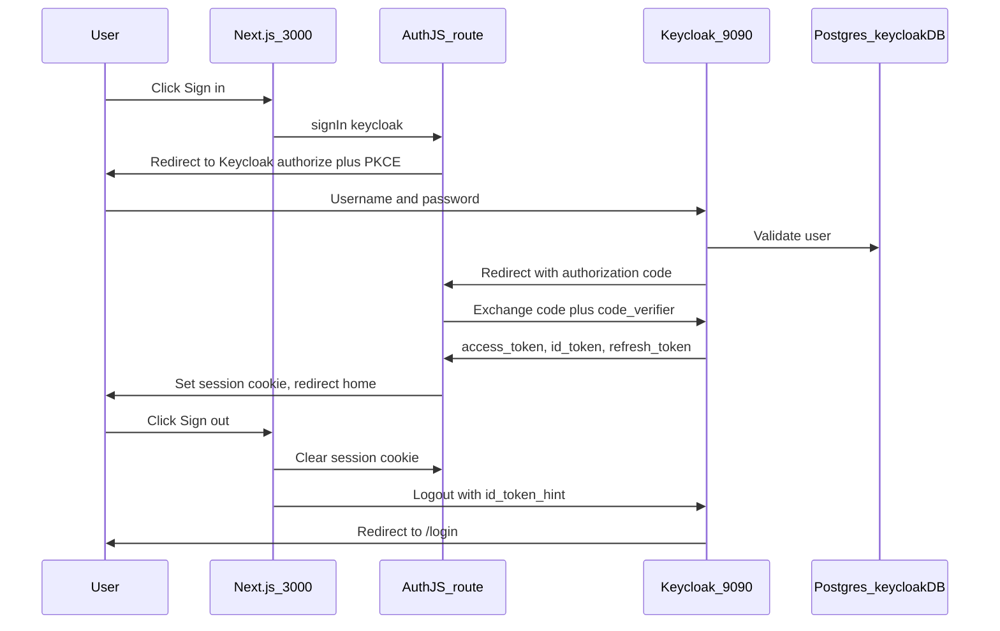

# HerdCommand authentication

This document describes the **login and logout** setup that is working locally: Next.js talks to an existing Keycloak on port **9090**, using OpenID Connect **Authorization Code + PKCE**. Postgres is used only by Keycloak for its own data. The web app never connects to Postgres for login.

---

## 1. What we built (summary)

| Piece | Choice | Why |
|---|---|---|
| Identity provider | Keycloak already running on `http://localhost:9090` | You already had it with Postgres (`keycloakDB`, user `postgres`, password `admin`). We did not start a second Keycloak. |
| Realm | `herdcommand` | Issuer URL is `http://localhost:9090/realms/herdcommand`. |
| Client ID | `herdcommand` | Public OpenID Connect client. |
| Client secret | None | Public client. Auth.js uses `token_endpoint_auth_method: none`. |
| App | Next.js on `http://localhost:3000` | Auth.js (NextAuth v5) is the BFF: it starts login, stores the session cookie, and never puts the password in HerdCommand forms. |
| Login flow | Authorization Code + PKCE (`S256`) | Required for public browser/server apps. Password stays on the Keycloak login page. |
| Session | Encrypted JWT cookie (`authjs.session-token`) | 30 minutes. Access token and id token are kept in that JWT so the API and logout can use them. |
| Logout | Keycloak end-session + clear app cookie | Ends SSO in Keycloak, then returns to `/login`. |

**Passwords and the database**

- Keycloak stores users in **your** Postgres (`keycloakDB`).
- HerdCommand only uses HTTP to Keycloak’s OIDC endpoints.
- If login fails, it is almost never the Postgres username/password. It is almost always a **client redirect URI** (or post-logout URI) mismatch.

---

## 2. Architecture



**Roles of each component**

- **Browser:** never sees the client secret (there is none). Sees Keycloak’s login page, then a session cookie from Next.js.
- **Next.js (`apps/web`):** branded HerdCommand screens, language (Arabic default), `signIn` / `logoutAction`.
- **Auth.js route** (`/api/auth/*`): OIDC client. Builds `authorize` URL, handles callback, stores tokens in the session JWT.
- **Keycloak:** authentication, sessions, tokens, logout.
- **Postgres:** Keycloak persistence only.

---

## 3. Keycloak configuration (what you must have)

Admin console: `http://localhost:9090`  
Realm (dropdown, top left): **herdcommand**  
Client: **herdcommand**

### 3.1 Capability

| Setting | Value |
|---|---|
| Client type | OpenID Connect |
| Client ID | `herdcommand` |
| Client authentication | **Off** (public) |
| Authorization | Off |
| Standard flow | **On** |
| Direct access grants | Off |
| Implicit flow | Off |
| PKCE (Advanced) | **S256** |

### 3.2 Login settings (this is what fixed login)

The app sends this **exact** `redirect_uri`:

```text
http://localhost:3000/api/auth/callback/keycloak
```

If this string is not in **Valid redirect URIs**, Keycloak shows:

```text
Invalid parameter: redirect_uri
```

Configure:

| Field | Value |
|---|---|
| Root URL | `http://localhost:3000` |
| Home URL | `http://localhost:3000` |
| Valid redirect URIs | `http://localhost:3000/api/auth/callback/keycloak` **and** `http://localhost:3000/*` |
| Web origins | `http://localhost:3000` |

### 3.3 Logout settings (this is what made sign-out work)

The app sends this **exact** `post_logout_redirect_uri`:

```text
http://localhost:3000/login
```

If it is missing, Keycloak shows:

```text
Invalid parameter: post_logout_redirect_uri
```

Configure:

| Field | Value |
|---|---|
| Valid post logout redirect URIs | `http://localhost:3000/login` **and** `http://localhost:3000/*` |
| Front-channel logout | On (if the toggle exists) |

### 3.4 Users

Create users in realm **herdcommand** (not `master` unless you intend that). Set a password and turn **Temporary** off.

Realm name (`herdcommand`) and client id (`herdcommand`) happen to be the same string. They are still two different objects: one is the realm, one is the OIDC client inside that realm.

---

## 4. Application configuration

File: `apps/web/.env.local`

```env
AUTH_SECRET=dev-secret-change-me-please-32ch
AUTH_TRUST_HOST=true
AUTH_KEYCLOAK_ID=herdcommand
AUTH_KEYCLOAK_SECRET=
AUTH_KEYCLOAK_ISSUER=http://localhost:9090/realms/herdcommand
NEXTAUTH_URL=http://localhost:3000
```

| Variable | Meaning |
|---|---|
| `AUTH_KEYCLOAK_ISSUER` | OIDC issuer. Must match Keycloak’s well-known config. |
| `AUTH_KEYCLOAK_ID` | Client ID. Must match the Keycloak client. |
| `AUTH_KEYCLOAK_SECRET` | Empty because the client is public. |
| `NEXTAUTH_URL` | Public URL of the Next.js app. Used to build callback and post-logout URLs. |
| `AUTH_SECRET` | Encrypts the Auth.js session cookie. Not a Keycloak secret. |
| `AUTH_TRUST_HOST` | Allows Auth.js to trust `localhost` in development. |

Code maps these in `apps/web/src/auth.ts`:

- Provider: Keycloak
- `checks: ['pkce', 'state']`
- `token_endpoint_auth_method: 'none'` (public client; no secret on the token request)

---

## 5. Login flow with a real example

### Step A — User clicks Sign in

Page: `http://localhost:3000/login`  
Server action calls `signIn('keycloak', { redirectTo: '/' })`.

### Step B — Browser is redirected to Keycloak

Example (shortened):

```text
http://localhost:9090/realms/herdcommand/protocol/openid-connect/auth
  ?response_type=code
  &client_id=herdcommand
  &redirect_uri=http://localhost:3000/api/auth/callback/keycloak
  &scope=openid profile email
  &state=<opaque CSRF value>
  &code_challenge=<S256 hash of code_verifier>
  &code_challenge_method=S256
```

Meaning of the important query params:

| Param | Example / role |
|---|---|
| `response_type=code` | Authorization Code flow. Keycloak will return a **code**, not tokens, in the browser URL. |
| `client_id=herdcommand` | Which client is asking. |
| `redirect_uri` | Where Keycloak is allowed to send the user back. Must match the client list **exactly**. |
| `state` | CSRF protection. Auth.js checks it on the way back. |
| `code_challenge` + `S256` | PKCE. The app keeps a secret `code_verifier`. Keycloak later checks that the token request proves the same client started login. |

The user types username/password **only on Keycloak**. HerdCommand never receives the password.

### Step C — Keycloak redirects back with a code

```text
http://localhost:3000/api/auth/callback/keycloak
  ?state=<same state>
  &session_state=<keycloak session>
  &iss=http://localhost:9090/realms/herdcommand
  &code=<one-time authorization code>
```

Handled by `apps/web/src/app/api/auth/[...nextauth]/route.ts`.

### Step D — Auth.js exchanges the code (server to server)

```text
POST http://localhost:9090/realms/herdcommand/protocol/openid-connect/token

grant_type=authorization_code
client_id=herdcommand
code=<the code>
redirect_uri=http://localhost:3000/api/auth/callback/keycloak
code_verifier=<original PKCE secret>
```

No `client_secret`. Keycloak returns:

- `access_token` — later used for Spring Boot APIs (`Authorization: Bearer ...`)
- `id_token` — identity claims; required for logout (`id_token_hint`)
- `refresh_token` — stored in the session JWT and used to get a new access token before expiry

### Step E — App session

Auth.js sets an HTTP-only cookie (typical name: `authjs.session-token`) and redirects to `/` (home). Home shows the signed-in name and Sign out.

### Step F — Silent refresh (before the access token dies)

On each `auth()` / session read, `apps/web/src/auth.ts` checks `expiresAt`. About **15 seconds before** the access token expires, `apps/web/src/lib/refresh-access-token.ts` calls Keycloak:

```text
POST http://localhost:9090/realms/herdcommand/protocol/openid-connect/token

grant_type=refresh_token
client_id=herdcommand
refresh_token=<stored refresh token>
```

No client secret (public client). Keycloak returns a new `access_token`, often a new `refresh_token` (rotation), and `expires_in`. Those values replace the old ones in the session cookie.

If refresh fails, the app runs the same logout path as Sign out (clear cookie + Keycloak end-session).

The user must **open a page or otherwise trigger a session read**. Refresh does not run in the background if the tab is idle and nothing calls `auth()`.

---

## 6. Logout flow with a real example

Clicking Sign out runs `logoutAction` in `apps/web/src/lib/logout.ts`.

1. Read `idToken` from the current Auth.js session.  
2. `signOut({ redirect: false })` — delete the HerdCommand cookie.  
3. Redirect the browser to Keycloak:

```text
http://localhost:9090/realms/herdcommand/protocol/openid-connect/logout
  ?client_id=herdcommand
  &post_logout_redirect_uri=http://localhost:3000/login
  &id_token_hint=<id_token from login>
```

| Param | Why |
|---|---|
| `client_id` | Tells Keycloak which public client is logging out. |
| `post_logout_redirect_uri` | Where to send the user after Keycloak SSO is killed. Must be in the client allow-list. |
| `id_token_hint` | Proves which session to end, so Keycloak does not need an extra confirmation page in most setups. |

If you only cleared the Next.js cookie and skipped this URL, the next “Sign in” would often **auto-login** because Keycloak still had an SSO cookie.

After Keycloak logout, the user lands on `http://localhost:3000/login` and must enter credentials again.

---

## 7. Code map

| File | Responsibility |
|---|---|
| `apps/web/.env.local` | Issuer, client id, app URL |
| `apps/web/src/auth.ts` | Auth.js + Keycloak provider, PKCE, session JWT |
| `apps/web/src/app/api/auth/[...nextauth]/route.ts` | OIDC callback and session HTTP API |
| `apps/web/src/app/[locale]/login/page.tsx` | Sign-in button → `signIn('keycloak')` |
| `apps/web/src/lib/logout.ts` | App cookie + Keycloak end-session |
| `apps/web/src/components/AppHeader.tsx` | Sign in / Sign out in the header |
| `apps/web/src/middleware.ts` | Locale + protect `/me` if no session cookie |

---

## 8. Errors we already hit (and the fix)

| Symptom | Cause | Fix |
|---|---|---|
| `Invalid parameter: redirect_uri` | Callback URL not in Valid redirect URIs | Add `http://localhost:3000/api/auth/callback/keycloak` |
| `Invalid parameter: post_logout_redirect_uri` | Logout return URL not allowed | Add `http://localhost:3000/login` to post-logout URIs |
| Sending `web-dev-secret` | Client is public | Leave `AUTH_KEYCLOAK_SECRET` empty; `token_endpoint_auth_method=none` |
| Postgres user/password in the Next.js app | Wrong layer | Postgres is only for Keycloak. Do not put `postgres` / `admin` in `.env.local` for OIDC. |

---

## 9. How to verify

1. Open `http://localhost:3000` → login screen (Arabic by default).  
2. Sign in → Keycloak form → back to home with your name.  
3. Sign out → Keycloak logout → back to login.  
4. Sign in again → username/password required (no silent SSO).

When the API is added later, call it with:

```http
GET http://localhost:8080/api/v1/me
Authorization: Bearer <access_token from the Auth.js session>
```
